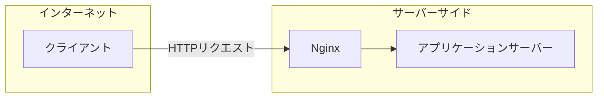

# [「SSRFの脆弱性について セキュアコーディングの啓蒙 第3回」](https://tech.uzabase.com/draft/entry/wv2j32HqKZoRMgoDhhlMgLVoZYo)のサンプルコードです

<image width="400px" src="https://github.com/uzabase/BlueTeam/assets/61903570/4e085741-3cdb-4dad-86d0-caa62e114c90" />

新入社員Aさんは、ある日、入力したリンクのプレビューを表示するアプリケーションを作ることになりました。
新入社員Aさんは、一旦サンプルとして PoC を作成したので、上長の 先輩エンジニアBさんにレビューを依頼しました。

構成はこちら👇

